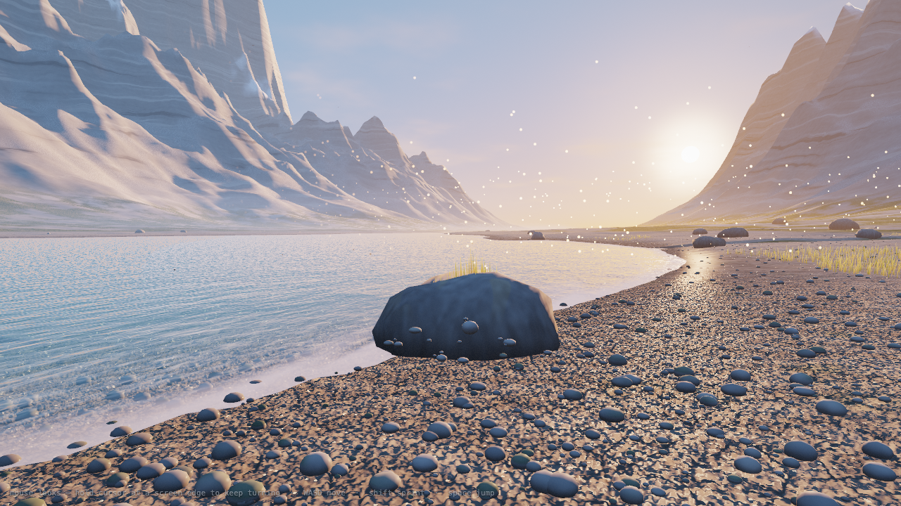

# Glacial Valley

A photorealistic alpine glacial valley at sunrise, running in real time in the browser.
**No game engine. No textures. No 3D models.** Every mountain, the braided river, the
grass, the birds — all generated procedurally from math, in ~2,400 lines of Three.js.

**▶ [Walk around in it](https://deedy.github.io/glacial-valley/)** — mouse looks
(hold the cursor at a screen edge to keep turning), WASD moves, Shift sprints,
Space jumps. You can wade into the river.



## How it works

- **Terrain** — erosion-weighted fBm (octaves damped by accumulated gradient) plus
  ridged multifractal peaks with domain warping. One height function drives the mesh,
  the physics, the water depth, and all object placement. The braided river emerges
  naturally: a wide shallow trough whose gravel-bar noise crosses the waterline.
- **Light & shadow** — the sun is static, so sun visibility is ray-marched over the
  heightfield and baked at load: mountains cast kilometer-long soft shadows, shaded
  areas stay cold blue, and the drifting mist respects fog shadows behind boulders.
- **Water** — two-pass screen-space refraction, Beer–Lambert absorption plus glacial
  rock-flour scattering (that's the turquoise), depth-faded caustics, bed-gradient
  rapids whitewater, shoreline foam, sun glitter.
- **Life** — 85k wind-bent grass blades with per-blade gust flutter, circling birds,
  fish-rise rings on calm pools, splash droplets at rapids, insects, pollen drifting
  in sunbeams, dew, wildflowers.
- **Pipeline** — all materials output linear HDR; a post pass applies ACES tonemapping,
  vignette, grain, and adaptive exposure that stops down as you turn toward the sun.

Everything is generated at load (~3–5 s): no asset files, no network requests beyond
the Three.js CDN module.

## Run locally

```bash
python3 serve.py        # serves on http://localhost:8123 with caching disabled
```

Any static file server works. WebGL2 required.

## Repo map

| File | What |
|---|---|
| `index.html` | shell, import map, loading overlay |
| `main.js` | terrain generation, shadow baking, scene assembly, player controller |
| `shaders.js` | all GLSL: terrain, water, sky, mist, grass, rocks, ice, birds, post |
| `serve.py` | no-cache dev server |
| `demo-video/` | script that produced the demo video (ElevenLabs VO + captions) |

Built with [Claude Code](https://claude.com/claude-code).
